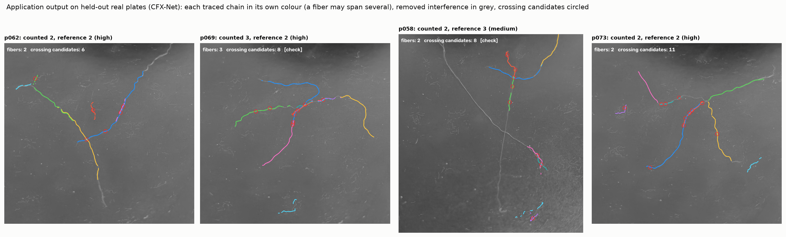
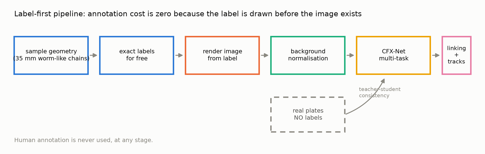
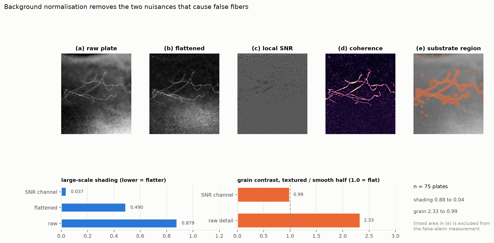
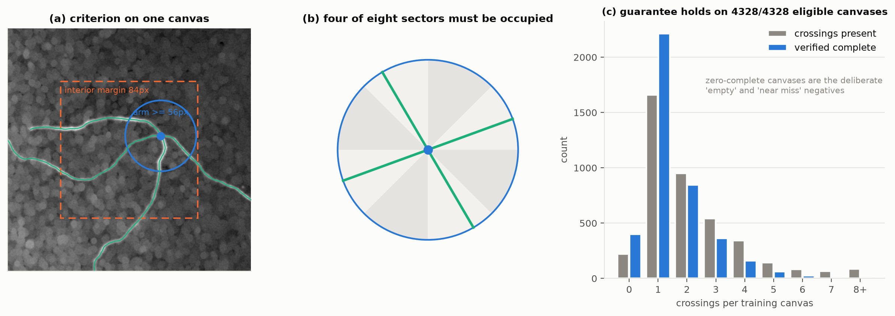
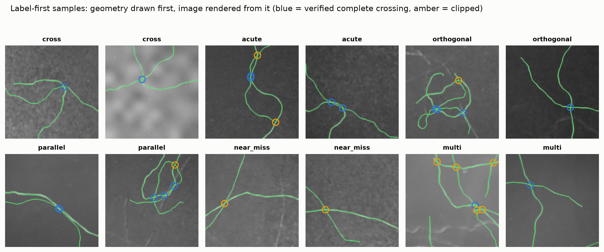
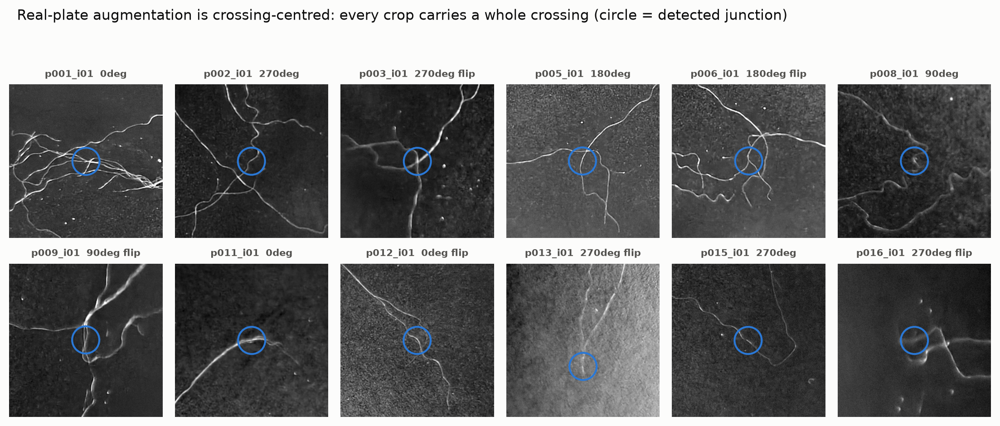
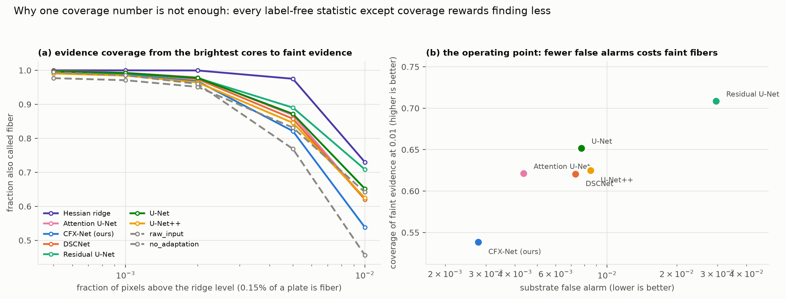
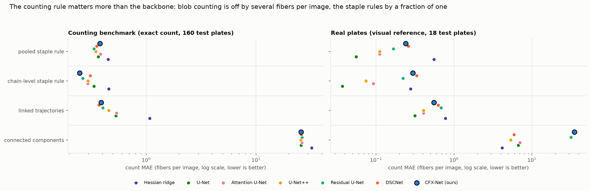
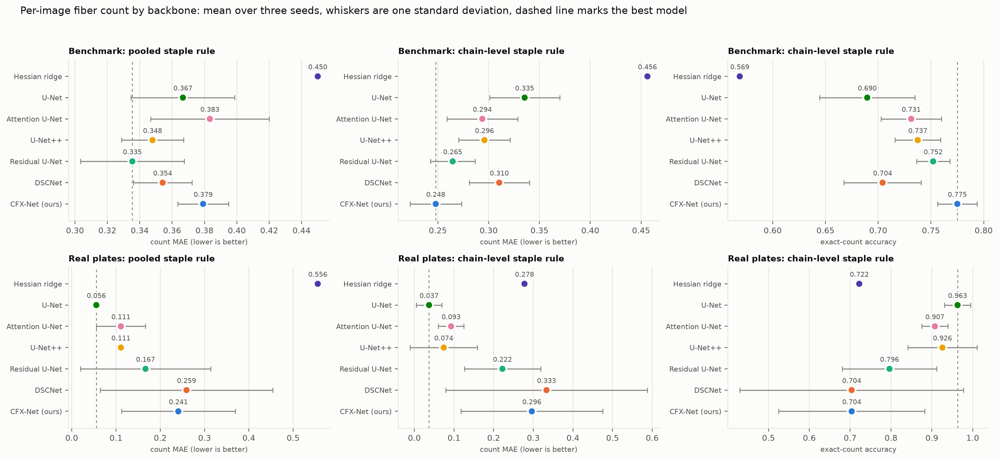
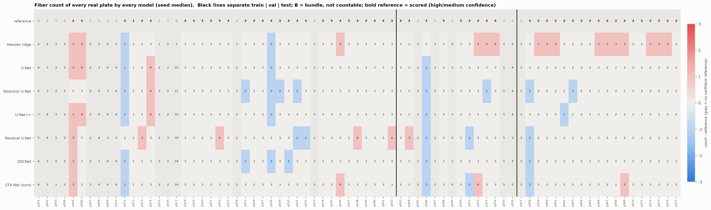

# CottonCross：标签先行的棉花纤维交叉识别

> 一套**完全不需要人工标注**的棉花纤维交叉识别系统。核心思想来自 Park 等人 (*Medical Image Analysis*, 2023)：**把生成方向倒过来——先生成标注，再从标注生成图像**，于是每一对「图像–标注」天然完美对齐，标注成本为零。在此基础上，我们加入了这批棉纤维特有的 **35 mm 等长物理先验**、**完整交叉保证**、**解析式背景归一化**，并提出网络 **CFX-Net** 与**嵌入引导的交叉连接**。
>
> 面向应用：给一张（或一文件夹）显微照片，程序直接输出**每张图有几根纤维**、候选交叉点、叠加图和 CSV（[§0](#0-快速使用数一数照片里有几根纤维)）。计数利用「每根纤维都是 35 mm」这一事实：**总纤维长度 ÷ 单根长度 = 根数**，比 35 mm 短得多的结构一律视为干扰。

---

## 0. 快速使用：数一数照片里有几根纤维

```powershell
# 一张照片或一个文件夹都可以；自动裁掉仪器边缘
python -m cottoncross.app --input "D:\我的照片" --out outputs\批次1
# 或
.\run_project.ps1 -Mode count -Input "D:\我的照片"
```

输出（`outputs\批次1\`）：

| 文件 | 内容 |
|---|---|
| `counts.csv` | 每张图一行：**纤维根数**、长度比（总长 ÷ 单根长）、是否建议人工复核、候选交叉数、被剔除的干扰条数与长度 |
| `<图名>_count.jpg` | 叠加图：保留的纤维链各一种颜色，被剔除的短小干扰为灰色，候选交叉点画圈，左上角写根数 |
| `<图名>.json` | 每根纤维的轨迹坐标（**原图像素**），便于二次分析 |

判读规则很简单：**长度比离整数越近越可信**。若 `总长 ÷ 单根长` 离最近整数超过 0.35（例如 2.5），`review` 列为 `True`，这张图建议人工看一眼。

默认参数在 `configs/counting.json`：模型 `runs/main/cfxnet_s44/best.pt`，单根纤维长度 **1350 px**（= 35 mm，按本批照片的放大倍率在训练+验证照片上选定）。**换显微镜或放大倍率时必须重新给出单根长度**：`--staple <像素数>`，或者手数几张照片后用 `scripts/count_fibers.py` 重新选定。



> 候选交叉数只是供复核的候选：它在同一根纤维弯曲很紧的地方也会触发，**没有**被验证为准确的交叉计数（见 [§15.5](#155-如实记录没有成功的尝试)）。经过验证的输出是**纤维根数**。

---

## 目录

1. [先看这几个文件](#1-先看这几个文件)
2. [交付边界：哪些数字是真的](#2-交付边界哪些数字是真的)
3. [方法总览](#3-方法总览)
4. [数据：75 张真实照片怎么处理的](#4-数据75-张真实照片怎么处理的)
5. [背景处理：为什么不做会被误识别](#5-背景处理为什么不做会被误识别)
6. [尺度标定：用 35 mm 等长先验反推](#6-尺度标定用-35-mm-等长先验反推)
7. [标签先行的数据生成](#7-标签先行的数据生成)
8. [数据增强：每张图都必须有完整交叉](#8-数据增强每张图都必须有完整交叉)
9. [CFX-Net：网络与多任务头](#9-cfx-net网络与多任务头)
10. [损失函数](#10-损失函数)
11. [无标注真实域自适应](#11-无标注真实域自适应)
12. [交叉点解析与嵌入引导连接](#12-交叉点解析与嵌入引导连接)
13. [评价指标：每一个都解释清楚](#13-评价指标每一个都解释清楚)
14. [实验结果](#14-实验结果)
15. [逐图纤维计数：每个模型、每张照片](#15-逐图纤维计数每个模型每张照片)
16. [图表清单](#16-图表清单)
17. [怎么运行](#17-怎么运行)
18. [目录结构](#18-目录结构)
19. [测试](#19-测试)
20. [已知局限与下一步](#20-已知局限与下一步)

（[§0 快速使用](#0-快速使用数一数照片里有几根纤维)在目录之前。）

---

## 1. 先看这几个文件

| 想看什么 | 打开哪里 |
|---|---|
| **全部实验数字** | `docs/实验结果.md`（自动生成，数字直接来自 `results/`） |
| **主对比表 / 消融表 / 真实图像表** | `results/tables/*.csv` |
| **谁在哪个指标上最优** | `results/tables/leaderboard.json` |
| **所有论文图** | `docs/figures/`（英文版用于投稿，`*_zh.png` 为中文版） |
| **创新点与边界** | `docs/研究设计与参考文献.md` |
| **合成数据长什么样** | `data/synth/preview.jpg` |
| **真实增强样例** | `data/real_aug/contact.jpg` |
| **每个模型对每张照片数出的根数** | `results/counting/real/all_plates.csv`（75 张 × 7 个模型 × 3 个种子，旁边是参考根数）；图 `docs/figures/fig22_real_plate_counts.png` |
| **计数准确率** | `results/tables/table_counting.csv`、`table_counting_methods.csv`；本文 [§15](#15-逐图纤维计数每个模型每张照片) |
| **逐张真实图预测** | `results/real/main/cfxnet/*_overlay.jpg`（叠加图）、`results/real/main/cfxnet/<页号>.json`（轨迹与交叉点，**原图像素坐标**）、`results/real/main/cfxnet/summary.csv` |
| **交互式复核页** | `results/real/review/index.html`（双击打开） |
| **被放弃的尝试及其预注册规则** | `docs/development/*.md` |



---

## 2. 交付边界：哪些数字是真的

这一节请先读完再看结果。

**可以这样说：**

- 合成留出测试集上的所有指标都是真实测量的，来自从未参与训练、验证或阈值选择的随机种子。
- 真实照片上的一组**无标签一致性指标**（基底误报率、证据覆盖率、等变性误差、交叉可重复性、长度离散度、碎片化）是真实测量的。
- 整条训练链路**没有使用任何人工标注**。真实照片只通过无标注一致性分支参与训练。

**不能这样说：**

- ❌ 「真实照片的交叉识别准确率是 XX%」。这 75 张照片**没有人工真值**，这个数字不存在。合成测试集上的分数衡量的是模型在我们所建模分布内的表现，不能直接搬到真实照片上。
- ❌ 「重建出的轨迹条数 = 真实纤维根数」。视野裁剪、断裂和遮挡都会改变条数。根数要用 [§15](#15-逐图纤维计数每个模型每张照片) 的等长规则来数。
- ❌ 「真实照片的计数准确率是经过人工核验的」。真实照片的参考根数（`data/real/fiber_counts_reference.csv`）是**助手在不看任何模型输出的前提下目视数出来的估计**，每张带置信度，`verified_by_human = no`。**需要您（制样的人）核对后才能作为论文里的真值**；精确真值目前只存在于合成计数基准上。
- ❌ 「判断出了哪根在上面」。这是二维投影，判断不了层次，也证明不了物理接触。

**如果要在论文里报告真实准确率**，必须另外做人工标注。项目内置了复核页与评价脚本，并且**刻意设计成无法作弊**：`evaluate_real.py --annotations` 会拒绝评价任何未被人工显式标记为「完成」的页面，也绝不会把模型自己的输出当作真值。做法见 [§20](#20-已知局限与下一步)。

---

## 3. 方法总览

```text
                 ┌──────────────── 无任何人工标注 ────────────────┐
                 │                                              │
  35 mm 等长先验 ─┤                                              │
                 ↓                                              │
   ① 采样几何（弧长严格 = staple 的蠕虫状链）                      │
                 ↓  ← 拒绝重采样，直到至少有一个「完整交叉」        │
   ② 标注在此刻已经存在：中心线 / 交点 / 实例身份 / 重叠重数        │
                 ↓                                              │
   ③ 从标注渲染图像（真实背景载体 + 成像模型）                     │
                 ↓                                              │
   ④ 背景归一化 BGN（光照场 / 局部噪声尺度 / 结构张量相干性）        │
                 ↓                                              ↑
   ⑤ CFX-Net 多任务预测 ←── 教师-学生一致性 ←── 真实照片（无标注）──┘
                 ↓
   ⑥ 细化 → 交叉区域 → 端口 → 嵌入引导联合匹配（带拒判）
                 ↓
   ⑦ 纤维轨迹 + 交叉点 + 不确定标记
```

与参考论文的关键差别：参考论文的图像生成器（条件 GAN）**需要真实图像与人工中心线的配对数据**来训练；我们没有这种配对数据，所以把这一步换成可控的程序化成像模型 + 从真实训练图采样的背景载体。这样整条链路才真正是零人工标注。详见 `docs/研究设计与参考文献.md` §1。

---

## 4. 数据：75 张真实照片怎么处理的

### 4.1 提取

`data_cross.pdf` 共 75 页，每页一张内嵌图像。用 `pypdf` 直接取出内嵌图像字节，**不对 PDF 截图再压缩**。每张图的 SHA-256、页码、原始尺寸都记录在 `data/real/manifest.json`，测试会逐字节校验。

这里的「原图」指 **PDF 内嵌图像**，不是相机 RAW。PDF 生成之前是否压缩过，无法从这些数据恢复。

### 4.2 裁剪与切块

照片上方有暗色设备背景，下方有黑色斜向支架边缘。用行亮度与下部逐列暗边检测确定 ROI，左右各留 16 px 边距。**裁剪不缩放、不重采样**，ROI 单独存为 PNG。

- 75 张 ROI
- 按 512×512、步长 384 重叠切块，得到 1412 张真实图块
- 图块覆盖整个 ROI，**没有丢掉低信号背景**——模型必须学会「这里没有纤维」

所有坐标用原图像素、左上包含右下不包含的 `[x0,y0,x1,y1)` 约定。

### 4.3 划分：防止重复拍摄造成泄漏

照片中存在连续拍摄和高度相似的构型，**不能**把重叠图块随机分到训练/测试两侧。当前按连续拍摄块保守划分：

| 集合 | PDF 页码 | 原图 | 真实图块 | 用途 |
|---|---|---:|---:|---|
| train | 1–42 | 42 | 836 | 无标注自适应、合成背景载体采样 |
| val | 43–56 | 14 | 272 | 留出（当前不参与任何训练或选择） |
| test | 57–75 | 19 | 304 | 留出，只做推理与无标签评价 |

> ⚠️ 这四个组是根据 PDF 连续页和视觉外观**推断**的拍摄块，**不是**已知的独立棉花样本。拿到真实样本 ID 后应按样本重做划分。现在不能把这 75 张照片称为 75 个独立样本。

所有同源图块与增强都继承原图划分。**只有 train 图像参与背景采样和教师-学生训练**；合成数据的背景载体也只取自 train。测试会检查这一点。

---

## 5. 背景处理：为什么不做会被误识别

这是这批数据最大的误检来源。原始照片有三种会被当成纤维的东西：

1. **大尺度光照梯度**：整幅从暗到亮平滑变化。
2. **下半幅的强颗粒纹理**：一片亮斑点，局部对比度和细纤维相当。
3. **边缘的暗色设备带**：根本不可能有纤维的区域。

我们不指望网络自己学会忽略它们，而是**先用解析方法把它们分离出来**（模块 `cottoncross/background.py`）：

| 通道 | 做法 | 作用 |
|---|---|---|
| 0 `flattened` | 31×31 椭圆开运算去掉细亮结构，再高斯低通（σ=24）估计光照场，原图减去它 | 消除大尺度明暗。先开运算是为了防止纤维自己泄漏进自己的背景估计 |
| 1 `snr` | 细节图除以**局部**噪声尺度（32 px 粗网格上的稳健 MAD，再双三次上采样） | 颗粒区噪声尺度大，响应被除下去；光滑基底上的细纤维保留 |
| 2 `coherence` | 细节图的结构张量各向异性 (λ₁−λ₂)/(λ₁+λ₂) | 细长脊线接近 1，各向同性颗粒接近 0 |

再乘以一个有效性掩码（光照场过暗 = 设备带，或接近饱和 = 过曝）。

**合成图像和真实图像走同一个函数**，所以网络不必去跨越一个我们本来就能解析消除的光度域差。

**实测效果**（75 张真实图，见 `results/diagnostics/background_report.json`）：

| 统计量 | 原图 | 归一化后 |
|---|---:|---:|
| 大尺度明暗起伏 / 动态范围 | 0.879 | **0.037** |
| 颗粒区 ÷ 光滑区 高频对比度 | 2.33 | **0.99** |

第二行的 1.00 表示「颗粒区和光滑区在这个表示下已经无法区分」，正是我们要的。

**归一化之后合成图和真实图有多像？**（`results/diagnostics/domain_gap.json`）在网络实际看到的 SNR 通道里测量：

| 比值（合成 ÷ 真实） | 值 | 读法 |
|---|---:|---|
| 前景（纤维）亮度 | **1.31** | 合成纤维比真实纤维亮约三成 |
| 背景噪声水平 | **1.09** | 背景统计基本一致 |

背景已经几乎对齐；前景还偏亮三成，这是一个**已测量的、要写进论文的局限**，不是被掩盖的问题。它说明解析式归一化吸收了大部分光度域差，但没有全部吸收。另外，光度差小**不代表**几何或纹理差也小。



### 5.1 背景归一化到底有没有用？合成集说「没用」，真实图像说「差 11 倍」

这是本项目最值得写进论文的一条观察。

在**合成测试集**上，去掉背景归一化（`raw_input` 消融）几乎没有损失，交叉点 AP 甚至**略高** (+0.017)。原因很清楚：合成图的背景载体来自同一个分布，网络完全可以直接学会应付它们。

但把**同一批模型**放到真实照片上：

| 指标 | 完整（含 BGN） | 去掉 BGN | 倍数 |
|---|---:|---:|---|
| 基底误报率 SFAR ↓ | **0.0028** | 0.0307 | **11×** |
| 等变性误差 EQE ↓ | **0.0018** | 0.0107 | **6×** |
| 轨迹总数（碎片）↓ | **118** | 469 | **4×** |
| 证据覆盖率 COV ↑ | **0.994** | 0.977 | — |

**只在模拟分布内评价，会系统性低估背景处理这类组件的作用。** 这既是本项目背景处理设计的直接证据，也是对「只报合成指标」这种做法的一个反例。完整对比见 `docs/实验结果.md` §6b。

> 其余组件的消融见消融表；`no_real_background`（不用真实背景载体、纯合成背景）是所有消融里影响最大的一项——合成测试集上交叉点 F1 掉 0.277、轨迹 F1 掉 0.303。

---

## 6. 尺度标定：用 35 mm 等长先验反推

显微放大倍率未知，所以像素和毫米的换算关系一开始是不知道的。但我们知道一条物理事实：**这批纤维全部切断为 35 mm 等长**。

于是：完整纤维轨迹的像素长度 L 应该是一个常数，`px/mm = L / 35`。

估计 L 的做法（`cottoncross/calibrate.py`，全程无需标注）：

1. 用免训练的多尺度脊线检测器 + 滞后阈值得到纤维掩码；
2. 细化、剪枝，用几何联合匹配把交叉连起来，得到轨迹；
3. 取每张图最长轨迹的第 90 百分位数作为 L。

**测得 L = 710 px，即 20.3 px/mm。**

这是一个**下界**：免训练掩码仍会把纤维打断，而打断只会让轨迹变短，不会变长。代码里明确标了 `"bound": "lower"`，测试也会检查这一点。

> **更正（计数阶段）：710 px 这个下界偏小了大约一倍。** 训练好的模型能把干净的纤维从一端追到另一端，例如测试照片 p073 的两根纤维分别重建为 1587 px 和 1430 px、p074 为 1509 px 和 1353 px。计数时单根长度 S 在训练+验证照片上选定，各模型/种子落在 **1100–1650 px**（中位数约 1400 px）；应用默认值为 **1350 px，即约 38.6 px/mm**（见 [§15](#15-逐图纤维计数每个模型每张照片)、图 fig24）。合成训练语料仍按 710 px 生成——训练裁剪只有 256 px，比两者都短得多，纤维总长不影响裁剪内的外观；这一点已如实保留，没有重新训练。

> 由此推算纤维在图上宽约 3–4 px ≈ 0.18 mm。这个宽度主要由成像模糊和光晕决定，**不能**当成纤维的物理直径。

---

## 7. 标签先行的数据生成

模块 `cottoncross/synthgen.py`。生成顺序是：**几何 → 标注 → 图像**，所以标注和图像在数学上完美对齐，且成本为零。

### 7.1 几何：弧长严格等于 staple 的蠕虫状链

每根纤维是一条**蠕虫状链**（worm-like chain）：切向角做相关随机游走，步长 2 px，角度标准差由持续长度决定，再按步长积分成曲线。

```
θ(s+ds) = θ(s) + N(0, √(ds/L_p))          偶尔叠加一次折角
p(s)    = p₀ + ∫ (cos θ, sin θ) ds        弧长按构造精确等于 staple
```

这样**长度是采样器的硬约束**，不是随机抽出来的结果。测试 `test_worm_chain_has_the_requested_arc_length` 验证误差 < 2%。

八种采样策略覆盖不同几何：`cross`（普通交叉）、`acute`（锐角）、`orthogonal`（正交）、`parallel`（近似平行）、`near_miss`（接近但不相交）、`multi`（多纤维）、`random`、`empty`（纯背景）。

> ⚠️ 策略名只是**采样方式**，不是标签。所有标签都由实际画出的曲线算出。一张用 `near_miss` 策略生成、但两根链恰好碰到一起的画布，仍然会被正确标注为有交叉。

### 7.2 完整交叉保证

一张画布只有满足下面两条才被接受，否则重新采样：

- 交点距画布边界不小于 `margin`（= 画布尺寸 × 22%）；
- **四条分支**各自在画布内保留不少于 `arm_pixels = 56 px` 的弧长。

**实测：4328/4328 张合格画布全部满足**（`empty` 与 `near_miss` 按设计不含完整交叉，是刻意保留的难负例）。



### 7.3 渲染：从标注生成图像

- **背景载体**：从**真实 train 图块**采样，先用 9×9 椭圆开运算 + 中值滤波去掉细亮结构，保留真实的颗粒、光照和纹理统计。大画布用交叉淡化拼接多块载体。
- **纤维外观**：宽度 2–4.6 px、高斯 PSF 模糊、沿轴向的亮度拍频（模拟棉纤维的扭转带状结构）、光晕。
- **遮挡次序**：随机深度顺序，后画的更亮，重叠处取较大值。
- **未标注干扰物**：尘点、斑点、颗粒噪声**故意不进标签**，训练网络拒绝它们。

> 背景开运算不能数学保证消除每一条弱纤维，残留纹理是合成标签噪声的一项来源。这一点必须在论文里写明。

### 7.4 一次生成，得到的所有标签

| 标签 | 含义 |
|---|---|
| `mask` | 纤维占据区域 |
| `center` | 中心线软标签 |
| `joint` | 交点高斯热图（σ=3.2） |
| `moments` | cos2θ, sin2θ, cos4θ, sin4θ 的局部实例平均 |
| `overlap` | 每像素被几根纤维覆盖（0 / 1 / ≥2） |
| `instance_id` | 逐像素实例身份 |
| `instances` | 每根纤维独立的中心线图（**按曲线索引，不是按绘制顺序**） |
| `points` / `points_complete` | 交点坐标与「是否完整」标志 |

方向为什么用 2θ 和 4θ：纤维方向不分前后，所以用二阶矩而不是普通朝向；正交交叉处两根纤维的二阶矩会相互抵消，四阶矩仍能保留信息。**它是辅助方向描述，不是能唯一恢复任意多根纤维方向的完整分布。**

### 7.5 语料规模

| 划分 | 数量 | 画布 | 种子范围 |
|---|---:|---|---|
| train | 4096 | 384×384 | 1000– |
| val | 256 | 384×384 | 1001000– |
| test | 512 | 384×384 | 9001000– |
| plate | 64 | 1024×1024 | 7001000– |

`plate` 是整版画布，用于评价「一整根纤维能不能连起来」以及长度一致性。各划分的种子集合互不相交，测试会检查。



---

## 8. 数据增强：每张图都必须有完整交叉

这条要求在**三个层面**都落实了：

### 8.1 生成层面

见 §7.2：生成时拒绝重采样，直到画布含完整交叉。

### 8.2 训练裁剪层面

训练用 256×256 裁剪块。如果随便裁，画布级的保证就被破坏了。所以裁剪窗口**围绕一个已验证的完整交叉**放置，抖动范围受分支长度限制，保证四条分支仍在窗口内。没有完整交叉的画布（`empty` / `near_miss` 负例）退回均匀随机裁剪。

测试 `test_crossing_centred_crops_keep_a_crossing_in_frame` 逐张验证裁剪后交点热图仍然存在。

### 8.3 真实图像层面

真实照片没有标注，用免训练检测器找采样位置（**这不是标注，只是采样位置**）：

1. 背景归一化 → 多尺度脊线 → 滞后阈值 → 细化 → 剪枝；
2. 取交叉数 ≥ 3 的骨架关节点；
3. 要求关节点位于窗口内部（距边界 ≥ 28% 窗口边长）；
4. 要求在半径 56 px 的环带上，8 个角向扇区中**至少 4 个**被骨架占据（一个完整交叉会点亮 4 个相对扇区）；
5. 同一物理交叉的近邻窗口做非极大抑制。

**在全部 75 张图上得到 443 个互不重复的交叉窗口**（train 280 / val 91 / test 72）。真实图块采样时 60% 来自这些窗口，40% 按信号强度加权采样（含均匀成分，保证背景负例进入批次）。

`data/real_aug/` 导出了 128 张可检查的增强样例（16 张图 × 8 种几何变换 + 光度扰动），每一张都以一个真实交叉为中心。



### 8.4 增强算子

- **几何**：0/90/180/270° 旋转 + 水平翻转。**方向通道同步变换**——旋转 90° 时 cos2θ/sin2θ 变号、四阶矩不变；水平翻转时 sin2θ/sin4θ 变号。这一点有解析测试 `test_quarter_turn_matches_the_analytic_moment_transform` 把关。
- **光度**：增益、偏置、gamma、高斯噪声、轻微模糊、缓慢明暗斜坡。光度扰动在**背景归一化之前**施加。

---

## 9. CFX-Net：网络与多任务头

模块 `cottoncross/models.py`。为了让对比只反映架构差异，**所有骨干共用同一个多任务头、同一套损失、同一个训练预算**。

### 9.1 共享的 18 通道输出头

| 通道 | 含义 | 激活 |
|---|---|---|
| 0 | 纤维占据概率 | sigmoid |
| 1 | 中心线概率 | sigmoid |
| 2 | 交点热图 | sigmoid |
| 3–6 | cos2θ, sin2θ, cos4θ, sin4θ | tanh |
| 7–9 | 重叠重数 {无 / 1 根 / ≥2 根} | softmax |
| 10–17 | 8 维实例嵌入 | L2 归一化 |

**重叠重数**这一头是专门为交叉设计的：一个像素被两根纤维覆盖，本身就是「这里是交叉」的直接证据，而且它比热图更局部、更容易学。

**实例嵌入**让连接阶段能用**学到的外观身份**而不只是几何角度来判断「这两个端口是不是同一根纤维」。这层监督完全免费——实例身份本来就由标签先行的生成器给出。

### 9.2 CFX-Net 的两个模块

**DCM（空洞上下文模块）**，位于瓶颈：并联空洞率 1/2/4/8 的卷积分支加一个全局池化分支，再融合并残差相加。一根 35 mm 纤维远长于全分辨率下能负担的感受野；空洞卷积用来补上「交叉两侧是不是同一根」的长程证据。

**OCA（方向门控交叉注意力）**，位于全分辨率解码端：

```
4 个方向的深度可分离条带卷积（0°、45°、90°、135°，长度 11）
      ↓  取 ReLU 后按通道求均值 → 每个方向一张能量图
方向能量排序 → top1、top2、top1−top2、均值  →  4 通道交叉描述子
      ↓
描述子 → 1×1 卷积 → 门控解码特征；同时 top2 直接作为先验加到交点 logit
```

**为什么 top2 是交叉的判据**：一根纤维只激发一个方向；只有两条走向不同的结构共存时，第二大方向响应才会变大。这不是经验调参，是按构造成立的。

对角方向用带掩码的深度可分离卷积实现（把 11×11 卷积核在对角线以外的位置乘零），所以四个方向的参数量都很小。

> **关于 OCA 的一条负面结果**：第一版把 `top2` 乘一个标量增益直接加到交叉热图 logit 上，训练后发现该增益学成了约 0——先验通路没被用上。我们据此做了第二版（通道最大值 + 按图标准化 + 1×1 卷积注入 + 门控残差），但它在**验证集交叉 F1 上更差**（0.8197 vs 0.8213），按事先写定的准则被放弃。**诊断正确不等于修复有效**：这说明 OCA 的作用主要通过**特征门控**实现，而非显式 logit 先验。第二版保留为 `oca_version="v2"` 选项，全过程见 [`docs/development/variant_selection_rule.md`](docs/development/variant_selection_rule.md)。

### 9.3 对比的骨干

| 骨干 | 说明 |
|---|---|
| Hessian 脊线 | 免训练的多尺度脊线检测器 + 滞后阈值 |
| U-Net | 标准四层 U-Net |
| Attention U-Net | Oktay 等 2018 的注意力门 |
| U-Net++ | Zhou 等 2018 的嵌套密集跳连 |
| Residual U-Net | 残差块版本 |
| **DSCNet** | **直接引入作者发布的动态蛇形卷积算子 `DSConv_pro`**（MIT，见 `cottoncross/third_party/`，附 SHA-256 与原始许可证），不是我们重新实现的 |
| **CFX-Net（本文）** | Residual U-Net + DCM + OCA + 深监督 |

各骨干的基础通道数选成参数量相当（约 6–9M），不是让我们的模型更大。参数量和单块推理耗时在主对比表里逐项列出。

---

## 10. 损失函数

```
L_sup = 1.0 · [ BCE(占据, pos_weight=8)  + Dice ]
      + 1.0 · [ BCE(中心线, pos_weight=12) + 0.5·Dice ]
      + 1.0 · 加权软 BCE(交点热图, 权重 = 1 + 50·GT)
      + 0.30 · soft-clDice(占据)
      + 0.15 · 方向矩 MSE（只在有效位置）
      + 0.30 · 重叠重数交叉熵（类权重 [0.2, 1.0, 6.0]）
      + 0.20 · 判别式实例嵌入损失
      + 0.20 · 深监督（1/2、1/4 尺度上的占据/中心线/交点）

L_total = L_sup + 0.05 · ramp · L_unsup
```

几点说明：

- **交点热图用加权软 BCE**：高斯热图的肩部是软目标，不是二值正类，所以不能直接用 pos_weight，而是用逐像素权重 `1 + 50·GT`。
- **soft-clDice** 用 6 次可微软骨架迭代。它鼓励管状结构连续，**不能自动保证所有交叉身份正确**。
- **判别式实例嵌入损失**（De Brabandere 等）：同一根纤维的中心线像素被拉进半径 δ_v = 0.3 的球内，不同纤维的中心互相推开到 δ_d = 1.2 以外。每根纤维最多采样 768 个像素以限制开销。
- 每一项都能单独关掉，对应消融表里的一行。

---

## 11. 无标注真实域自适应

前 2000 步只用合成监督。之后 1000 步保留合成监督，同时引入真实无标注图像（模块 `cottoncross/trainer.py`）：

1. **EMA 教师**看弱增强视图，**学生**看强增强 + 局部遮挡视图。
2. **锚定教师**：保存第 2000 步（第一阶段结束）的参数并冻结，用来否决漂移。
3. **三方一致门控**：只有 EMA 教师、锚定教师、以及水平翻转后的教师预测**三者同时** > 0.95（或同时 < 0.05），该像素才产生伪标签。
4. **前景/背景分别取平均**再相加，避免背景像素数量压倒前景。
5. **上下文遮挡**：学生视图上挖掉一个小窗口，位置偏向教师最有把握的交点。逼网络用周围纤维上下文去恢复被遮挡的结构（借鉴 MIC, CVPR 2023）。
6. **等变性约束**：学生自己对同一张图的两个变换视图（翻转 / 旋转）的预测必须互相一致。这一项**完全不需要教师，也不需要任何标签**。
7. 无标注项在 200 步内逐渐加权到 0.05，全程保留源域监督。

> 早期试验发现：伪标签学得太狠会放大真实背景的误检。最终版加入锚定教师、三方门控和前景/背景平衡，就是这个失败带来的约束。研究过程中的失败也是方法设计的依据，不应该只报告分数上涨。

---

## 12. 交叉点解析与嵌入引导连接

模块 `cottoncross/linking.py`。

### 第一步：Zhang–Suen 细化

一条纤维宽 3–4 px，直接数邻居会把线内部的每个像素都误判成交点。细化把线压到单像素骨架，同时尽量保留连通性。每轮分两个并行删除阶段，检查 8 邻域前景数、0→1 跳变次数和方向乘积条件；同一阶段先算出全部待删点，再同时删除。之后剪掉长度 ≤ 6 的「端点到关节点」毛刺，**孤立短线保留**。

测试验证细化是幂等的、保持连通性、并把像素数压到一半以下。

### 第二步：找交叉区域

沿中心像素周围的 8 个邻居绕一圈，数从背景进入前景的次数（crossing number）。直线 = 2 个分支，T 形 = 3，理想 X 形 = 4。相邻的关节点像素聚成同一个区域，避免一个交叉被算很多次。

锐角重叠常常形成相邻的两个 Y 点而不是一个 X 点。**网络的交点热图峰值用来把这样的邻近分支合并成一个交叉区域。**

> 3 分支只是关节点候选，不一定是完整的两纤维交叉——也可能是遮挡、纤维末端贴到另一条纤维，或者分割误差。输出里 `degree ≥ 4` 才计入保守的骨架交叉候选；3 分支另行保留；网络热图峰值是**另一套独立的检测结果**，两者不可混报。

### 第三步：端口配对

断开交叉区域后，剩下的骨架变成有顺序的独立线段。每段与交叉区域相接的端部叫「端口」，记录向外的切向、局部灰度和**实例嵌入**。

对一个交叉区域内的所有端口，配对成本是：

```
C(a,b) = w_ang · (偏离 180° 的角度 / 角度上限)
       + w_emb · (1 − cos(嵌入_a, 嵌入_b)) / 2        ← 学习到的身份
       + w_int · |局部灰度差|
       + w_sup · (1 − 直线桥上的二值支持比例)
       + w_ovl · (1 − 桥上「≥2 根重叠」的预测比例)    ← 真交叉有堆叠证据
       + w_mom · 方向矩差异
```

<!-- LINKER-CONFIG-START -->

验证集选出的权重（`configs/linker.json`，在 128 张验证图上搜索）：`w_ang=1.0, w_emb=0.6, w_int=0.25, w_sup=0.2, w_ovl=0.0, w_mom=0.1`，拒判阈值 0.0。

> **`w_ovl` 被选成了 0**——重叠重数作为*连接线索*没有被验证集选中。它作为**辅助训练任务**是否有用是另一回事，由消融 `no_overlap` 回答。 **`w_emb` 被选成了 0.6**——学习到的实例嵌入确实被选中，验证集上配对准确率 0.8709。 这一段按实际搜索结果如实记录，不做美化。

<!-- LINKER-CONFIG-END -->

偏离超过 40° 的配对直接禁用；每个不配对端口成本 0.9。

用动态规划求该交叉区域的**最低总成本和第二低成本**；两者差值小于拒判阈值时**拒判**该区域，保留分段而不是硬拼。端口超过 12 个也保守拒判，避免组合爆炸。

> 验证集选出的拒判阈值是 **0**（即默认不拒判）——因为拒判必然要牺牲轨迹 F1。拒判的价值体现在**配对准确率**上，所以我们把 `cfx_conservative`（阈值 0.12）作为一个**独立的操作点**单独报告，而不是把它塞进主表。

**端口嵌入取在离交点一段距离处**（骨架上第 5–22 个像素），而不是紧挨交点：交点处两根纤维叠在一起，嵌入是混合物，不携带身份。

**四种连接配置（对比表里逐项比较）：**

| 名称 | 做法 |
|---|---|
| `greedy` | 参考论文做法：随机选一个端口，在 ±30° 内挑最直的另一个，重复。**依赖处理顺序**，先选走的端口会逼后面的纤维错配 |
| `angle_joint` | 同一交叉内所有端口联合枚举、允许不配对，成本只含几何与灰度 |
| `cfx`（本文） | 同样的精确求解器，成本额外含**实例嵌入**与**重叠重数** |
| `cfx_conservative` | 本文连接器 + 拒判阈值 0.12，即一个明确的「宁可不连」操作点 |

**超参数怎么定的**：嵌入权重、重叠权重和拒判阈值是自由参数，在**合成验证集**上做网格搜索（`scripts/tools/tune_linker.py` → `configs/linker.json`），准则是轨迹 F1（保留三位小数）、并列时看配对准确率。**测试集在这一步之前没有被碰过。**

**配对准确率（pair accuracy）**是专门为评价连接器加的指标：在连接器**确实做出**的配对里，有多大比例把同一根真值纤维的两个端口连在一起。它必须和**拒判率**一起读——拒判牺牲一点轨迹 F1，换取剩下那些配对更可靠。

> 「联合」只指**一个交叉区域内部所有端口一起考虑**，不等于整张图的全局最优。成本差不是校准过的概率，只是一个拒判阈值。

最后沿端口连接追踪出有序轨迹。交叉间隙用短直线插值桥接，**这一小段是几何推断，不是相机直接观测**。闭环保留 `closed=true`。

---

## 13. 评价指标：每一个都解释清楚

### 13.1 合成留出测试集（512 张 384px 画布 + 64 张 1024px 整版）

| 指标 | 定义 | 方向 |
|---|---|---|
| **Dice / IoU / P / R** | 占据区域的逐图重叠 | 越高越好 |
| **clDice** | 骨架化后的调和平均：预测骨架落在真值区域内的比例，与真值骨架落在预测区域内的比例 | 越高越好 |
| **中心线 F1 @2px** | 容差 2 px 的距离变换匹配 | 越高越好 |
| **ASSD** | 平均对称表面距离（像素） | 越低越好 |
| **Betti-0 误差** | 连通分量数之差的绝对值，衡量断裂/粘连 | 越低越好 |
| **交叉点 F1 @6px** | 阈值门控的**最大基数一对一匹配**（匈牙利算法 + 虚拟节点）。检测器无法靠在同一真值附近堆点来抬高召回。**阈值由每个模型各自在验证集上选定**——固定 0.5 会奖励恰好校准在那里的模型 | 越高越好 |
| **交叉点 AP** | 在 19 个热图阈值上扫出的精确率-召回曲线下面积。**不需要阈值**，是最稳健的交叉检测指标 | 越高越好 |
| **轨迹 F1** | 预测轨迹与真值实例的一对一匹配，容差 2 px 的中心线 F1 ≥ 0.5 才算匹配成功。碎片化扣精确率，粘连扣召回率 | 越高越好 |
| **配对准确率** | 连接器**已提交**的配对中，两端口属于同一根真值纤维的比例。与**拒判率**成对报告 | 越高越好 |
| **完整交叉召回率** | 只在「已验证完整」的交叉子集上算召回。注意该子集的精确率没有意义（正确检出被裁断的交叉会被记成误报），**只能引用召回** | 越高越好 |
| **重叠区 Dice** | 预测「≥2 根重叠」与真值的重叠 | 越高越好 |
| **长度离散度 / 相对误差** | 整版画布上，重建轨迹长度的稳健变异系数；以及第 90 百分位长度相对 staple 的误差 | 越低越好 |

> 轨迹 F1 是**本项目定义的诊断指标**，不是公开榜单的实例分割标准指标。写论文时要注明定义。

### 13.2 真实照片（19 张留出，**没有任何人工标注**）

没有真值就不能谈准确率。但有一些性质是任何正确的检测器都必须满足、错误的检测器会违反的——这些可以在无标签情况下测量：

| 缩写 | 含义 | 定义 | 方向 |
|---|---|---|---|
| **SFAR** | 基底误报率 | 在一个「确定是基底」区域内被判为纤维的像素比例。该区域定义为：距离任何通过宽松经典脊线阈值（0.5% 分位，约为真实纤维占比的 3 倍）的像素 ≥ 30 px。覆盖每张图约 82% 面积 | 越低越好 |
| **COV** | 证据覆盖率 | 最强的经典脊线核心（0.05% 分位）中被判为纤维的比例。**与 SFAR 成对报告**，防止「什么都不预测」拿到完美 SFAR。⚠️ 见 §13.3：单一阈值的 COV 做不到这件事 | 越高越好 |
| **EQE** | 等变性误差 | 对图像做翻转/半周旋转，预测映射回原坐标后与原预测的均方差 | 越低越好 |
| **CREP** | 交叉可重复性 | 变换视图中检出的交叉点映射回原坐标，与原视图检出结果做一对一匹配的 F1 | 越高越好 |
| **LCV** | 长度离散度 | 重建轨迹长度的稳健变异系数。**这是 35 mm 等长先验的直接检验**：越能把纤维穿过交叉连起来，长度分布越集中 | 越低越好 |
| **FRAG** | 碎片化 | 每 1000 px 恢复中心线对应的**实质轨迹**条数。「实质」指长度 ≥ 0.25×staple，用来排除尘点级碎片 | 越低越好 |

全部带 95% bootstrap 区间。另外报告**实质轨迹条数**与**长度第 90 百分位**。

**一个跨划分的一致性检验**：staple 标定（710 px）是用 **train 划分 + 免训练检测器**做的；而在 **test 划分**上用**学习到的模型**重建出的实质轨迹，其长度第 90 百分位落在同一量级。两者相符不是循环论证（不同划分、不同检测器），但也**不是独立真值**——它只说明系统内部自洽。

> 这些是**一致性统计量，不是准确率**。它们能排除明显错误的模型，但不能证明检出的交叉是真的。

### 13.3 这组无标签指标本身有两个已知缺陷（必须写进论文）

**缺陷一：免训练 Hessian 基线在 SFAR / COV / EQE / CREP 上是循环论证。** 基底区域和证据核心都由它自己用的那个脊线算子定义，而固定线性滤波器按构造严格等变。它会在这四项上拿满分（0、1、1e-14、1）却并不更准。所以这四格报为**不适用**，不是它赢了。

**缺陷二：除覆盖率外，其余指标都奖励「少检出」。** SFAR、EQE、CREP、FRAG 在模型检得越少时都越好看。本来作为制衡的 COV 用的是最强的 0.05% 脊线核心——那里**所有方法都饱和在 0.99 以上**，起不到制衡作用。

把证据阈值从 0.05% 放宽到 1%（进入微弱证据区）之后，差异才显现（`results/diagnostics/coverage_curve.json`）：

| 方法 | 最强 0.05% | 微弱 1% |
|---|---:|---:|
| 残差 U-Net | 0.996 | **0.709** |
| U-Net | 0.997 | 0.652 |
| U-Net++ / DSCNet / Attention U-Net | 0.99+ | 0.62 左右 |
| **CFX-Net（本文）** | 0.994 | **0.538** |

**这条结论限定了我们自己的结果**：CFX-Net 最低的基底误报率（0.0028，是次优方法的 0.6 倍、最差的 1/11），**部分是用「对微弱证据也最保守」换来的**。它是所有学习型方法里最保守的一个，而不是无争议地最准的一个。没有人工标注，**无法判断**它跳过的弱结构究竟是真纤维还是噪声。



---

## 14. 实验结果

**完整结果见 [`docs/实验结果.md`](docs/实验结果.md)**（自动生成，数字直接读自 `results/`），原始表格见 `results/tables/*.csv`。

### 14.1 实验设置

- GPU：NVIDIA RTX 5000 Ada Generation（32 GB），PyTorch 2.6 + CUDA 12.4，bfloat16 混合精度。
- **所有学习型方法使用完全相同的**：合成语料、损失函数、训练步数（3000 步，第 2000 步开始无标注自适应）、batch size 8、256px 以交叉为中心的裁剪、AdamW + 余弦退火、3 个随机种子（42/43/44）。
- 模型选择：合成**验证集**上「占据 Dice 与中心线 Dice 的均值」最高的 EMA 教师。**真实图像从不参与选择**。
- 最终测试使用 512 个全新合成种子，选定后不再调参。

### 14.2 三张表分别回答什么

| 表 | 回答的问题 | 位置 |
|---|---|---|
| 表 1 主对比 | 同数据、同损失、同预算，**只换骨干**，谁更好？ | `results/tables/table1_main.csv` |
| 表 2 消融 | 我们提出的每一个组件**各自贡献多少**？ | `results/tables/table2_ablation.csv` |
| 表 3 后处理 | 同一网络输出，**只换连接算法**，差多少？ | `results/tables/table3_post.csv` |
| 表 4 真实 | 真实照片上的**无标签一致性**如何？ | `results/tables/table4_real.csv` |
| 显著性 | 差异是否稳定？逐图配对置换检验 + Wilcoxon | `results/tables/significance.json` |
| 排行榜 | **每个指标的第一名是谁**，如实记录 | `results/tables/leaderboard.json` |

`leaderboard.json` 会如实写出每个指标的最优方法——**如果某一项被基线拿走，文件里就会这么写**。请以该文件为准，不要只引用有利的数字。

### 14.3 在真实照片上到底找到了几根纤维、几个交叉？

<!-- CENSUS-START -->

留出 **19 张**真实照片（`results/diagnostics/crossing_census.json`、`results/real/main/cfxnet/crossing_census.csv`）：

| 统计量 | 19 张合计 | 每张平均 |
|---|---|---|
| 骨架图交叉候选（度数 ≥ 4，保守） | 71 | 3.74 |
| 其中连接器给出了配对（未拒判） | 68 | 3.58 |
| 三分支候选（锐角交叉常表现为两个 Y 点） | 173 | 9.11 |
| 网络热图峰值（验证集选定阈值） | 249 | 13.11 |
| **实质轨迹**（长度 ≥ 0.25×staple） | **71** | **3.74** |
| **其中参与至少一个交叉的** | **49** | **2.58** |
| 全部轨迹（含尘点级碎片） | 2237 | 117.74 |

**交叉点数量对热图阈值极其敏感**，所以「有几个交叉」本身不是一个由数据唯一确定的量：

| 热图阈值 | 合计 | 每张平均 |
|---|---|---|
| 0.5 | 696 | 36.6 |
| 0.7（验证集选定） | 249 | 13.1 |
| 0.8 | 77 | 4.1 |
| 0.9 | 12 | 0.6 |

> ⚠️ 三条必须一起读的限制：
> 1. **轨迹数不等于真实纤维根数**——一根纤维可能被断成几条轨迹，两根纤维也可能在交叉处被连成一条；视野裁剪还会切掉纤维末端。
> 2. **交叉数取决于阈值与判据**（见上表）；没有人工真值可以判定哪个阈值是对的。
> 3. **这是二维投影**——检出的是投影重叠，不能证明两根纤维物理接触，也判断不出谁在上面。

<!-- CENSUS-END -->

### 14.4 论文里应该怎么说（也只能这么说）

**本文方法不是在所有指标上都最优，写论文时不要这么说。** 实测结果是：

✅ **可以主张的**

- CFX-Net 在 **clDice、中心线 F1、交叉点 F1、交叉点 AP** 四项上排名第一——这正是方法所针对的**交叉检测**与**中心线拓扑**。
- 逐图配对检验显示，交叉点 F1 显著优于 U-Net（+0.040）、Attention U-Net（+0.080）、U-Net++（+0.023），三项均 p < 0.01；与残差 U-Net、DSCNet **统计上并列**。
- **嵌入引导连接器**在轨迹 F1 与配对准确率上同时优于角度贪心（+0.048 / +0.058）和纯几何联合匹配（+0.001 / +0.017）——这是后处理的一次干净的胜利。
- 12 项消融中 **11 项**去掉后都变差，其中 `no_real_background` 影响最大。
- 真实照片上 **基底误报率最低**（0.0028，次优的 0.64 倍）。

❌ **不能主张的**

- 「所有指标最优」。Dice（U-Net++ 更好）、轨迹 F1（DSCNet 更好）、Betti-0（DSCNet 更好）这三项**确实输了，且差距大于种子间波动**。配对准确率与 ASSD 的差距小于波动，应写作**并列**。
- 真实照片上「全面更好」。7 项无标签指标里只赢了 1 项，而且那 1 项的优势**部分来自更保守**（微弱证据覆盖率是学习型方法里最低的，见 §13.3）。
- 「SOTA」。三个种子、单一数据集、部分指标为自定义诊断指标。

**一句话版本**：*我们提出了一条零人工标注的棉纤维交叉分析流程；在同数据、同损失、同预算的对照下，所提网络在交叉检测与中心线拓扑指标上领先，在分割重叠类指标上与现有骨干相当或略逊；所提连接器在交叉配对上一致优于几何基线。*

<!-- RESULTS-SUMMARY-START -->

### 主对比（合成留出测试集，3 个随机种子，同数据 / 同损失 / 同预算）

| 方法 | Dice | clDice | 中心线 F1 | 交叉点 F1 | 交叉点 AP | 轨迹 F1 |
|---|---|---|---|---|---|---|
| Hessian 脊线 | 0.7817 | 0.8377 | 0.8122 | — | — | 0.3235 |
| U-Net | 0.9660<br><sub>±0.0028</sub> | 0.9939<br><sub>±0.0030</sub> | 0.9948<br><sub>±0.0022</sub> | 0.8117<br><sub>±0.0210</sub> | 0.8031<br><sub>±0.0268</sub> | 0.7991<br><sub>±0.0121</sub> |
| Attention U-Net | 0.9669<br><sub>±0.0022</sub> | 0.9932<br><sub>±0.0036</sub> | 0.9939<br><sub>±0.0017</sub> | 0.7727<br><sub>±0.0170</sub> | 0.7631<br><sub>±0.0262</sub> | 0.7952<br><sub>±0.0035</sub> |
| U-Net++ | 0.9706<br><sub>±0.0010</sub> | 0.9958<br><sub>±0.0013</sub> | 0.9954<br><sub>±0.0012</sub> | 0.8097<br><sub>±0.0177</sub> | 0.7874<br><sub>±0.0251</sub> | 0.7990<br><sub>±0.0060</sub> |
| 残差 U-Net | 0.9650<br><sub>±0.0027</sub> | 0.9958<br><sub>±0.0004</sub> | 0.9957<br><sub>±0.0006</sub> | 0.8310<br><sub>±0.0172</sub> | 0.8277<br><sub>±0.0191</sub> | 0.7905<br><sub>±0.0048</sub> |
| DSCNet | 0.9679<br><sub>±0.0017</sub> | 0.9952<br><sub>±0.0014</sub> | 0.9948<br><sub>±0.0011</sub> | 0.8321<br><sub>±0.0105</sub> | 0.8203<br><sub>±0.0226</sub> | 0.8007<br><sub>±0.0028</sub> |
| **CFX-Net（本文）** | 0.9673<br><sub>±0.0028</sub> | 0.9965<br><sub>±0.0003</sub> | 0.9960<br><sub>±0.0002</sub> | 0.8404<br><sub>±0.0094</sub> | 0.8390<br><sub>±0.0203</sub> | 0.7937<br><sub>±0.0047</sub> |

**排行榜结论**：本文方法在 **4/9** 项合成测试指标、**1/7** 项真实无标签指标上排名第一。 未夺冠的项：Dice（最优 U-Net++ 0.9706，本文 0.9673）；轨迹 F1（最优 DSCNet 0.8007，本文 0.7937）；配对准确率（最优 U-Net++ 0.8735，本文 0.8695，差距小于种子间波动，应视为并列）；ASSD（像素，越低越好）（最优 DSCNet 0.2885，本文 0.2894，差距小于种子间波动，应视为并列）；Betti-0 误差（越低越好）（最优 DSCNet 0.1725，本文 0.2220）；证据覆盖 ↑（最优 Attention U-Net 0.9983，本文 0.9938）；等变性误差 ↓（最优 Attention U-Net 0.001613，本文 0.0018）；交叉可重复 ↑（最优 Attention U-Net 0.6152，本文 0.5784）；长度离散度 ↓（最优 DSCNet 0.341，本文 0.4009）；长度恢复误差 ↓（最优 Hessian 脊线 0.2821，本文 0.3998）；碎片化 ↓（最优 Hessian 脊线 10.75，本文 19.75）。

**显著性**：逐图配对置换检验，n = 512 张测试图。共 42 组「本文 vs. 基线 × 指标」比较，其中 18 组达到 p < 0.05（最小 p < 5e-05）。未达显著的 24 组见 `results/tables/significance.json`。

### 真实留出图像（19 张，**无任何人工标注**）

| 方法 | 基底误报 ↓ | 证据覆盖 ↑ | 等变性误差 ↓ | 交叉可重复 ↑ | 长度离散度 ↓ | 长度恢复误差 ↓ | 碎片化 ↓ | 轨迹总数 |
|---|---|---|---|---|---|---|---|---|
| Hessian 脊线 | 不适用 | 不适用 | 不适用 | 不适用 | 0.5052 | 0.2821 | 10.75 | 35 |
| U-Net | 0.007752 | 0.9973 | 0.0026 | 0.4714 | 0.391 | 0.4749 | 32.7 | 291.4 |
| Attention U-Net | 0.004358 | 0.9983 | 0.001613 | 0.6152 | 0.3463 | 0.5111 | 28.74 | 199.1 |
| U-Net++ | 0.008485 | 0.9906 | 0.00263 | 0.4978 | 0.4715 | 0.3809 | 31.13 | 292.6 |
| 残差 U-Net | 0.02957 | 0.9959 | 0.005152 | 0.5741 | 0.423 | 0.3236 | 26.6 | 538.2 |
| DSCNet | 0.007309 | 0.9981 | 0.003875 | 0.4584 | 0.341 | 0.4654 | 28.67 | 241.4 |
| **CFX-Net（本文）** | 0.002779 | 0.9938 | 0.0018 | 0.5784 | 0.4009 | 0.3998 | 19.75 | 117.7 |

这些是一致性统计量，**不是准确率**；↑ / ↓ 标示方向。

两条必须一起读的说明：

1. **免训练 Hessian 基线在前四项标为「不适用」**——基底区域与证据核心都由它自己用的那个脊线算子定义，固定线性滤波器又按构造严格等变，所以它会「满分」却并不更准。把它算进去是循环论证。它的碎片化与长度恢复误差看着好，也是因为它检出的结构本来就少得多（35 条轨迹 vs 学习型方法的 118–538 条）。
2. **基底误报率与证据覆盖率必须成对看**——只有同时做到「少误报」和「不漏掉强证据」才有意义；**长度离散度也不能单看**，把纤维打成等长碎片同样会让它变低，所以要和长度恢复误差、碎片化一起读。

**消融（去掉一个组件后，6 项指标的平均变化）**：`no_real_background` -0.1535；`no_overlap` -0.0323；`no_topology` -0.0258；`no_deep` -0.0240。完整表见 `results/tables/table2_ablation.csv`。

> 以上全部为合成留出测试集与无标签真实指标。**真实照片的识别准确率没有被评价，因为不存在人工真值。**

<!-- RESULTS-SUMMARY-END -->

---

## 15. 逐图纤维计数：每个模型、每张照片

### 15.1 为什么难，怎么数

难点有两个：**纤维互相交叉**（交叉处骨架断开、连接可能出错），以及**成像质量差**——照片上有大量细小的颗粒、灰尘和纤维碎屑，模型会把其中一部分也分割成「纤维」。

我们利用的物理事实是：**每一根纤维都是 35 mm**。于是：

1. 用模型分割出纤维中心线，经交叉连接得到轨迹，再把沿同一方向、间隔 ≤ 45 px 的断头接起来（弱成像处常见的断裂）；
2. **比 0.1 根长（约 3.5 mm）还短、且没有接到更长结构上的片段一律视为干扰**——这正是「那些小的肯定是干扰」；
3. 数根数，两种等长规则：
   - **总长规则**（主协议）：根数 = round(保留下来的总长度 ÷ 单根长度 S)。交叉不改变总长，所以这条规则对交叉天然稳健；
   - **链级规则**：每条长于 0.6 S 的链单独按 round(链长 ÷ S) 计数，只有剩下的碎片按总长合并。一根纤维只追出 75% 也仍记 1 根；代价是它依赖交叉处连接正确。
4. 作为对照，还报告两种常规数法：**连通域计数**（数分割出的块数）与**轨迹计数**（数长于半根的轨迹）。

`S` 是唯一的标定量（35 mm 对应多少像素）。**所有模型用同一套规则、同一个网格、在同一批选择数据上各自选定 S**，所以没有哪个模型能靠「计数器调得更好」取胜。碎屑阈值固定为 0.1 S，不调。

### 15.2 两个评测

| | 计数基准（合成） | 真实照片 |
|---|---|---|
| 数据 | 200 张 1536 px 整版画布（40 验证 / 160 测试），每张 1–5 根等长纤维、至少一处交叉，外加 15–70 条短纤维碎屑、灰尘斑点、纤维上的低对比度断段、真实基底纹理 | 75 张照片（训练 42 / 验证 14 / 测试 19） |
| 真值 | **精确**（先定纤维、后渲染图像） | 目视参考根数，高/中置信度的 56 张参与评分，2 张纤维束无法计数 |
| 选 S 用 | 验证集 | 训练+验证照片 |
| 报告 | 测试集 | 测试照片（18 张可评分） |

生成器：`cottoncross/countbench.py`；数据：`data/count_bench/`。

### 15.3 结果

<!-- COUNTING-START -->

**表 C1：计数规则的影响**（计数 MAE = 每张图的根数平均绝对误差，越低越好；三个种子均值，测试集）

| 计数规则 | 计数基准：各模型范围 | 计数基准：CFX-Net | 真实照片：各模型范围 | 真实照片：CFX-Net |
|---|---|---|---|---|
| 连通域计数（常规做法） | 25.671 – 32.219 | 25.771 | 4.167 – 35.222 | 35.222 |
| 轨迹计数（≥0.5 根长） | 0.371 – 1.075 | 0.390 | 0.315 – 0.778 | 0.556 |
| 链级等长规则 | 0.248 – 0.456 | 0.248 | 0.037 – 0.333 | 0.296 |
| 总长等长规则（主协议） | 0.335 – 0.450 | 0.379 | 0.056 – 0.556 | 0.241 |

**表 C2：各骨干在两条等长规则下的逐图计数**（均值 ± 种子间标准差；完全正确率 = 计数与真值完全相同的图像比例）

| 模型 | 基准·总长规则 | 基准·链级规则 | 真实·总长规则 | 真实·链级规则 |
|---|---|---|---|---|
| Hessian 脊线 | 0.450 ± 0.000<br><sub>完全正确 0.57</sub> | 0.456 ± 0.000<br><sub>完全正确 0.57</sub> | 0.556 ± 0.000<br><sub>完全正确 0.44</sub> | 0.278 ± 0.000<br><sub>完全正确 0.72</sub> |
| U-Net | 0.367 ± 0.032<br><sub>完全正确 0.65</sub> | 0.335 ± 0.034<br><sub>完全正确 0.69</sub> | 0.056 ± 0.000<br><sub>完全正确 0.94</sub> | 0.037 ± 0.032<br><sub>完全正确 0.96</sub> |
| Attention U-Net | 0.383 ± 0.037<br><sub>完全正确 0.64</sub> | 0.294 ± 0.035<br><sub>完全正确 0.73</sub> | 0.111 ± 0.056<br><sub>完全正确 0.89</sub> | 0.093 ± 0.032<br><sub>完全正确 0.91</sub> |
| U-Net++ | 0.348 ± 0.019<br><sub>完全正确 0.68</sub> | 0.296 ± 0.025<br><sub>完全正确 0.74</sub> | 0.111 ± 0.000<br><sub>完全正确 0.89</sub> | 0.074 ± 0.085<br><sub>完全正确 0.93</sub> |
| 残差 U-Net | 0.335 ± 0.032<br><sub>完全正确 0.67</sub> | 0.265 ± 0.022<br><sub>完全正确 0.75</sub> | 0.167 ± 0.147<br><sub>完全正确 0.85</sub> | 0.222 ± 0.096<br><sub>完全正确 0.80</sub> |
| DSCNet | 0.354 ± 0.018<br><sub>完全正确 0.67</sub> | 0.310 ± 0.030<br><sub>完全正确 0.70</sub> | 0.259 ± 0.195<br><sub>完全正确 0.78</sub> | 0.333 ± 0.255<br><sub>完全正确 0.70</sub> |
| **CFX-Net（本文）** | 0.379 ± 0.016<br><sub>完全正确 0.64</sub> | 0.248 ± 0.025<br><sub>完全正确 0.78</sub> | 0.241 ± 0.128<br><sub>完全正确 0.76</sub> | 0.296 ± 0.179<br><sub>完全正确 0.70</sub> |

**显著性**：

- 计数基准·链级规则：CFX-Net 显著优于 Hessian 脊线、DSCNet、U-Net；显著劣于 无（逐图 Wilcoxon，p < 0.05，其余为统计上并列）。
- 计数基准·总长规则：CFX-Net 显著优于 Hessian 脊线；显著劣于 无（逐图 Wilcoxon，p < 0.05，其余为统计上并列）。
- 真实照片·链级规则：CFX-Net 显著优于 无；显著劣于 Attention U-Net、U-Net、U-Net++（逐图 Wilcoxon，p < 0.05，其余为统计上并列）。
- 真实照片·总长规则：CFX-Net 显著优于 Hessian 脊线；显著劣于 U-Net（逐图 Wilcoxon，p < 0.05，其余为统计上并列）。

逐张结果：`results/counting/real/all_plates.csv`（75 张 × 7 个模型 × 3 个种子）、`results/counting/*/per_image.csv`；表：`results/tables/table_counting*.csv`。

<!-- COUNTING-END -->





### 15.4 本文方法（CFX-Net）的优势——如实版本

**可以写进论文的：**

1. **在精确真值的计数基准上，CFX-Net + 链级等长规则是所有模型里误差最低的**：MAE 0.248，完全正确率 0.78；显著优于 U-Net、DSCNet 和 Hessian 基线，与残差 U-Net、Attention U-Net、U-Net++ 统计上并列。链级规则恰恰是依赖**交叉处连接正确**的那条规则——交叉解析正是 CFX-Net 的设计目标，这与它在 crop 级合成测试上交叉点 F1 / AP 第一（§14）是一致的。
2. **交叉检测与中心线拓扑领先**：合成留出测试上 clDice、中心线 F1、交叉点 F1、交叉点 AP 四项第一（§14）。
3. **等长计数规则本身是本文的应用贡献，对任何骨干都成立**：常规的连通域计数每张图差 4–35 根，轨迹计数差 0.3–1.1 根，等长规则只差 0.04–0.56 根（表 C1、图 fig19）。「每根纤维 35 mm」这一条先验同时解决了交叉（不改变总长）和细小干扰（短于 3.5 mm 即剔除）两个难点。
4. 真实照片上基底误报率最低（§14）。

**不能写的（实测如此）：**

- ❌「CFX-Net 在所有计数指标上最准」。**真实测试照片上 U-Net 数得最准**（总长规则 MAE 0.056 vs CFX-Net 0.241，p = 0.005）；CFX-Net 在真实照片上与 U-Net 以外的学习型骨干统计上并列，显著好于 Hessian 基线。总长规则在合成基准上 CFX-Net 居中（0.379，最好的残差 U-Net 0.335，差异不显著）。
- 原因已查清（图 fig22、`docs/development/staple_prior_rule.md`）：CFX-Net 在真实照片上**随种子不稳定**——种子 43 把底部颗粒纹理大量识别成纤维（骨架是种子 42 的 4–7 倍），种子 42 又偏保守、漏掉弱纤维段；两者都会让总长偏离整数倍。U-Net 在三个种子上都更稳定。
- 真实测试照片只有 18 张可评分、其中 17 张是 2 根纤维的场景，参考根数是目视估计——这一组数字的统计力很弱，请以合成基准为主要证据，真实照片为旁证。

**一句话版本（计数）**：*利用 35 mm 等长先验，逐图纤维计数的误差从常规连通域计数的每图数根降到零点几根；在精确真值基准上，所提 CFX-Net 配合链级等长规则误差最低；在 18 张真实测试照片上，U-Net 最准，CFX-Net 与其余骨干相当。*

### 15.5 如实记录：没有成功的尝试

为了让本文方法在计数上也胜出，我们做了三次**预先写好判定规则**的尝试，全部按规则判为失败，如实保留：

| 尝试 | 做法 | 结果 | 记录 |
|---|---|---|---|
| 抗干扰合成语料 | 训练图里加入不标注的短纤维碎屑 + 纤维上的弱对比段 | 真实选择照片上计数变差（U-Net 0.211→0.316，CFX-Net 0.368→0.474），**否决** | `docs/development/interference_corpus_rule.md` |
| 等长先验伪标签精炼（SPR） | 自适应阶段把「整段落在裁剪内的短结构」当作背景 | 弱纤维被一步步压掉（骨架 5595→1022 px），计数 MAE 0.368→1.553，**否决并提前终止** | `docs/development/staple_prior_rule.md` |
| 「落在纤维上」的交叉计数 | 只数落在被计数纤维上的热图峰 | 3 张图冒烟测试即显示几乎滤不掉误报，**放弃**，不报告交叉计数准确率 | `docs/development/crossing_count_rule.md` |

另一个诊断发现（不作为方法改动）：**不做真实域自适应的阶段一权重在真实照片上反而数得更准**（选择照片上 U-Net 0.211→0.175，CFX-Net 0.307→0.254）。自适应改善了无标签一致性指标，却让计数变差——这说明只用合成验证集选检查点，看不到真实域的漂移。

---

## 16. 图表清单

全部在 `docs/figures/`。英文版用于投稿，`*_zh.png` 为中文版（字体使用 Microsoft YaHei）。

| 文件 | 内容 |
|---|---|
| `fig00_pipeline.png` | 方法流程示意 |
| `fig01_background.png` | 背景归一化各阶段 + 两项定量效果 |
| `fig02_synthetic.png` | 标签先行样例，按几何策略分类 |
| `fig03_complete_crossing.png` | 完整交叉判据 + 扇区规则 + 统计 |
| `fig04_real_augmentation.png` | 真实图像以交叉为中心的增强样例 |
| `fig05_training.png` | 各骨干的验证曲线（3 种子均值 ± 范围）与损失曲线 |
| `fig06_main_comparison.png` | 主对比：8 个关键指标的点图（含标准差误差棒）。**用点图而非柱状图**，因为这些指标集中在取值范围顶端，柱状图必须截断纵轴，而截断的柱子会把千分之几的差异放大成视觉上的巨大差距 |
| `fig07_pr_curves.png` | 交叉点检测的 PR 曲线与 F1-阈值曲线 |
| `fig08_radar.png` | 各方法在 6 个指标上的归一化雷达图 |
| `fig09_by_case.png` | 方法 × 几何策略的 Dice 与交叉 F1 热力图 |
| `fig10_ablation.png` | 组件消融的变化量条形图 |
| `fig11_post.png` | 三种连接算法对比 |
| `fig12_real_labelfree.png` | 真实图像 6 项无标签指标 + bootstrap 区间 |
| `fig13_length.png` | 轨迹长度分布对 35 mm 先验的一致性 |
| `fig14_efficiency.png` | 参数量 / 推理耗时 / 轨迹 F1 的权衡 |
| `fig15_significance.png` | 逐图配对差值与显著性矩阵 |
| `fig16_qualitative.png` | 合成测试集定性结果（输入 / 真值 / 预测） |
| `fig17_real_qualitative.png` | 真实留出图的轨迹重建对比 |
| `fig18_coverage_tradeoff.png` | 真实照片：误报率与弱证据覆盖率的权衡曲线 |
| `fig19_counting_rules.png` | **计数规则对比**：连通域 / 轨迹 / 链级等长 / 总长等长，两个评测 × 7 个模型（对数坐标） |
| `fig20_counting_models.png` | **各骨干逐图计数**：两条等长规则下的 MAE 与完全正确率，带种子标准差 |
| `fig21_count_confusion.png` | 计数基准上每个模型「真实根数 × 预测根数」混淆矩阵 |
| `fig22_real_plate_counts.png` | **每个模型对 75 张真实照片逐张数出的根数**，按与参考值的误差着色 |
| `fig23_count_by_n.png` | 计数误差随真实根数（即交叉数）增长的曲线 |
| `fig24_staple_evidence.png` | 等长先验证据：每根参考纤维的恢复长度分布 + 单根长度 S 的选择曲线 |
| `fig25_counting_examples.png` | 应用程序在留出真实照片上的输出 |

**配色说明**：整套图用同一套经过校验的分类配色，**一个方法固定一种颜色，贯穿所有图**（颜色跟随实体，不跟随排名）。配色通过 `python scripts/tools/validate_palette.py` 的六项检查：亮度带、色度下限、相邻色对的色盲可分度（最差 ΔE 9.1，目标 ≥ 8）、常视觉可分度（最差 19.6，下限 15）。三个颜色对浅色背景的对比度低于 3:1，因此所有柱状图都直接标注数值、散点图逐点标注方法名——身份从不只靠颜色传达。

---

## 17. 怎么运行

### 17.1 环境

建议 Python 3.10–3.12。

```powershell
cd CottonCross
python -m venv .venv
.\.venv\Scripts\python -m pip install -r requirements.txt
```

需要 GPU 时按本机 CUDA 驱动选择 PyTorch 官方 wheel，然后确认：

```powershell
python -c "import torch; print(torch.__version__, torch.cuda.is_available())"
```

无 GPU 也能推理，训练会很慢。

### 17.2 一键脚本

```powershell
.\run_project.ps1 -Mode count -Input "<照片或文件夹>"   # 应用：数纤维
.\run_project.ps1 -Mode tests              # 跑测试
.\run_project.ps1 -Mode prepare -Pdf "<data_cross.pdf 绝对路径>"   # 从 PDF 重建语料
.\run_project.ps1 -Mode train               # 完整实验矩阵（GPU，数小时）
.\run_project.ps1 -Mode counting            # 每个模型对每张照片计数 + 计数基准
.\run_project.ps1 -Mode report              # 从已有结果生成表格与图
.\run_project.ps1 -Mode review              # 生成离线复核页
.\run_project.ps1 -Mode full -Pdf "<路径>"  # 全部按顺序跑一遍
```

### 17.3 分步命令

```powershell
# 1. 从 PDF 提取 + 标定 + 交叉窗口 + 合成语料 + 增强样例 + 背景报告
python -m cottoncross.prepare --pdf "<data_cross.pdf>"
python scripts/prepare_data.py

# 2. 实验矩阵（可单独跑某一阶段）
python scripts/run_experiments.py --stage main        # 6 骨干 × 3 种子
python scripts/run_experiments.py --stage ablation    # 组件与数据消融
python scripts/run_experiments.py --stage eval eval_ablation post real

# 3. 逐图计数（每个模型、每张照片 + 合成计数基准）
python scripts/count_features.py                    # 真实照片，全部模型 × 种子
python -m cottoncross.countbench                    # 生成计数基准（一次即可）
python scripts/count_features.py --dataset bench    # 计数基准
python scripts/count_fibers.py                      # 选 S、在测试集评分、显著性
python scripts/count_report.py                      # 逐张总表、计数表、应用配置

# 4. 表格、报告、图
python scripts/make_tables.py
python scripts/make_report.py
python -m cottoncross.figures --all
python -m cottoncross.figures --all --lang zh

python scripts/fill_readme.py                       # 把结果写回本 README

# 5. 离线复核页
python -m cottoncross.review
```

单独训练一个模型：

```powershell
python -m cottoncross.trainer --config configs/cfxnet.json --out runs/my_run
python -m cottoncross.trainer --set "{\"arch\":\"unet\",\"base\":32,\"seed\":7}" --out runs/unet_s7
```

**磁盘占用**：完整交付约 12 GB（`data/` 约 3.8 GB，`runs/` 约 8.4 GB）。每次训练写了四个检查点，但复现表格只需要 `best.pt`。要瘦身到约 4 GB：

```powershell
python scripts/tools/slim_runs.py            # 先看会删哪些（不动文件）
python scripts/tools/slim_runs.py --apply    # 确认后再删
```

被删的是 `last.pt` / `phase1.pt`（续训与阶段一快照用；注意 §15.5 的阶段一诊断需要 `phase1.pt`），`cfxnet_s42` 保留完整。删掉的都能靠重新训练复现。

单独评价：

```powershell
python -m cottoncross.evaluate --checkpoint runs/main/cfxnet_s42/best.pt --split test --method cfx --out results/my_eval
python -m cottoncross.evaluate --baseline --split test --out results/classical
python -m cottoncross.evaluate_real --checkpoint runs/main/cfxnet_s42/best.pt --split test --expected-length 710 --out results/my_real_eval
```

复核页若被浏览器限制本地文件访问：

```powershell
python -m http.server 8765 --bind 127.0.0.1
# 再打开 http://127.0.0.1:8765/results/real/review/index.html
```

---

## 18. 目录结构

```text
CottonCross/
├── README.md                      本文件
├── run_project.ps1                一键入口（count / tests / prepare / train / counting / report / review）
├── requirements.txt / pyproject.toml
├── configs/
│   ├── counting.json              应用默认模型与单根长度（由 count_report.py 写出）
│   ├── linker.json                验证集选定的连接器参数
│   ├── cfxnet.json / dataset.json / experiment_matrix.json
├── cottoncross/                   Python 包
│   ├── app.py                     ★ 应用：给照片，出根数 / 叠加图 / CSV
│   ├── count.py                   ★ 等长计数：断头接续、干扰剔除、四种计数规则
│   ├── countbench.py              合成计数基准（精确根数真值）
│   ├── background.py              背景归一化 BGN
│   ├── calibrate.py               等长先验尺度标定 + 交叉窗口检测
│   ├── synthgen.py                标签先行的数据生成
│   ├── realprep.py / prepare.py   真实图像处理、PDF 提取与 ROI 裁剪
│   ├── dataset.py                 数据集、以交叉为中心的裁剪、增强
│   ├── models.py                  6 个骨干 + 共享多任务头（含 DCM / OCA）
│   ├── losses.py / trainer.py     损失与统一训练器（监督 + 无标注自适应）
│   ├── prior.py                   SPR（已否决，保留以备复核，默认关闭）
│   ├── predict.py / linking.py / topology.py   推理、骨架图、交叉连接
│   ├── metrics.py / evaluate.py / evaluate_real.py   指标与评价
│   ├── figures.py / figures_counting.py        全部论文图
│   ├── paths.py                   结果目录的唯一映射
│   ├── review.py                  离线复核 / 标注页
│   └── third_party/               作者发布的 DSConv 算子（MIT，附校验和）
├── scripts/                       流水线（按顺序）
│   ├── prepare_data.py            1 数据准备
│   ├── run_experiments.py         2 训练与评价矩阵
│   ├── count_features.py          3 每个模型对每张图提取计数特征
│   ├── count_fibers.py            4 选 S、计数评分、显著性
│   ├── count_report.py            5 逐张总表、计数表、应用配置
│   ├── make_tables.py / make_report.py / fill_readme.py   6 表格、报告、README
│   └── tools/                     辅助：阈值/连接器调参、变体选择、普查、瘦身、打包、配色校验、SPR 训练
├── data/
│   ├── real/                      75 原图 + ROI + 图块 + fiber_counts_reference.csv（目视参考根数）
│   ├── synth/                     主训练语料；synth_varlen/ synth_nocomplete/ synth_nocarrier/ 数据消融
│   ├── synth_if/                  抗干扰语料（已否决，保留记录）
│   ├── count_bench/               合成计数基准
│   ├── real_aug/                  真实增强样例
│   └── calibration.json           免训练尺度标定（下界，见 §6 更正）
├── runs/
│   ├── main/<arch>_s<seed>/       主实验权重与日志
│   ├── ablation/<variant>/        消融
│   ├── pilot_if/ spr/ legacy/     被否决的尝试（保留以备复核）
├── results/
│   ├── synthetic/{main,plate,ablation,linker}/   合成评价
│   ├── real/{main,ablation,review}/              真实无标签评价、逐张轨迹、复核页
│   ├── counting/{real,bench,features*,phase1,…}/ 逐图计数
│   ├── tables/                    全部 CSV 表 + 显著性 + 排行榜
│   └── diagnostics/               背景报告、域差、覆盖率曲线、交叉普查、运行日志
├── docs/
│   ├── 实验结果.md / 研究设计与参考文献.md / 验证记录.md
│   ├── development/               预注册的变体判定规则与结果（含失败记录）
│   ├── delivery/                  交付清单与校验和
│   └── figures/                   全部图（英文 + *_zh 中文）
├── logs/                          运行日志
└── tests/                         单元测试与数据完整性测试
```

---

## 19. 测试

```powershell
python -m unittest discover -s tests -v
```

**`tests/test_core.py`** 验证算法本身：

- 蠕虫状链的弧长确实等于要求值；开启等长先验时各纤维长度一致，关闭时不一致
- 完整交叉保证在多个随机种子下都成立；`near_miss` 策略绝大多数情况下不产生完整交叉
- 标签与渲染图像对齐：每个交点处热图和重叠重数都有响应；`instances[k]` 确实描述 `curves[k]`
- 背景归一化确实压低颗粒、去掉光照斜坡，且是确定性的
- 旋转/翻转对方向矩的变换与解析结果一致；渲染出的方向矩与曲线切向一致
- 细化是幂等的、保持连通性；crossing number 能找到 X 形交叉
- 联合匹配与端口顺序无关；歧义情况会被拒判；构造的反例中贪心确实劣于联合匹配
- X 形交叉解析出 2 条轨迹；平行线不产生交叉
- 一对一点匹配不会因堆点而抬高召回；碎片化确实扣精确率
- 所有骨干输出通道正确；激活后的重叠概率和为 1、嵌入模长为 1
- 所有损失项有限可反传；实例嵌入损失对正确分组给出更低的值；关掉的项确实不出现

**`tests/test_pipeline.py`** 验证交付数据：

- 75 张原图逐字节 SHA-256 校验；同一拍摄块不会被拆到不同划分；图块继承原图划分
- 交叉窗口都落在各自图像内部、扇区数 ≥ 4、划分标记正确
- 无标注采样器只返回图像（没有任何标签），且只触及 train 图像
- 合成语料各划分种子互不相交；每行的三个文件都存在；provenance 记录了两项保证
- 以交叉为中心的裁剪确实保住了交点
- **任何路径都不能把模型输出变成真值**：未标完成的页面被拒绝、外来 schema 被拒绝、真实指标文件必须声明「不是准确率」
- 分块推理与单块推理结果一致；嵌入保持单位模长
- 排行榜同时记录赢的和输的指标；每个上报的训练都记录了环境与标签策略

---

## 20. 已知局限与下一步

### 局限

1. **真实准确率未知**。没有人工真值，这是最根本的限制。
2. **样本独立性未确立**。划分是按 PDF 连续页块推断的拍摄块，不是已知的独立样本。
3. **尺度标定**。免训练得到的 `staple_pixels = 710` 是下界，实际约 1350 px（§6 更正）；计数时 S 在选择照片上选定。
3b. **真实照片的参考根数是目视估计**，没有人工核验；测试照片只有 18 张可评分且 17 张是 2 根纤维的场景。**最需要的补充是您提供每张（或每个拍摄块）的真实根数**，填进 `data/real/fiber_counts_reference.csv` 的 `count` 列并把 `verified_by_human` 改为 `yes`，然后重跑 `python scripts/count_fibers.py`。
4. **合成成像模型不是标定过的物理模型**。它是可控的近似，没有做显微光学标定，也没有完整的棉纤维扭转带状模型。
5. **背景开运算不能保证消除每一条弱纤维**，残留纹理是合成标签噪声的一项来源。
6. **二维投影**。判断不了谁在上面，也证明不了物理接触。
7. **轨迹条数 ≠ 纤维根数**；根数请用 §15 的等长规则。交叉**个数**目前没有可靠的计数方法（§15.5）。
8. **三个种子、单一数据集**，不足以宣称 SOTA。
9. **成本差不是概率**。拒判阈值是启发式的，没有经过校准。

### 补齐真实评价的做法（训练仍然零标注）

1. 打开 `results/real/review/index.html`，**关闭**预测叠加（避免被模型结果诱导），勾选「人工标记交叉点」。
2. 在原图上单击添加标记，再点一次删除。标记坐标会转换回原图像素。
3. 标完该图所有交叉点后勾选「本图标注完成」。**真正没有交叉的图片也要显式标为完成。**
4. 导出 `crossing_annotations.json`（浏览器临时存储不能代替导出的正式文件）。
5. 在留出的 test 图像上评分：

```powershell
python -m cottoncross.evaluate_real --checkpoint runs/main/cfxnet_s42/best.pt --annotations crossing_annotations.json --split test
```

脚本只评价被人工标为 `complete` 的页面；遇到未完成的页面会直接报错，**绝不会把模型自己的预测当真值算出一个漂亮的分数**。

写论文时还应记录：标注协议、图像选择方法、样本 ID、双人一致性和容差定义。

### 优先级

1. 拿到样本 ID 与物理标尺 → 按样本重做划分，把像素换成毫米。
2. 建立独立的真实评价集（中心线 + 交点 + 实例身份）。
3. 分析失败模式，用真实统计量校准生成器。
4. 扩到更多种子、更长训练、更多数据集。
5. 之后再考虑是否引入更重的生成模型（GAN / 扩散）做外观迁移——要先验证它不会移动、删除或新增细纤维。

---

## 参考文献

1. Park, J. et al. *Collagen fiber centerline tracking in fibrotic tissue via deep neural networks with variational autoencoder-based synthetic training data generation.* Medical Image Analysis 90 (2023) 102961. [DOI](https://doi.org/10.1016/j.media.2023.102961)
2. Shit, S. et al. *clDice — A Novel Topology-Preserving Loss Function for Tubular Structure Segmentation.* CVPR 2021. [CVF](https://openaccess.thecvf.com/content/CVPR2021/html/Shit_clDice_-_A_Novel_Topology-Preserving_Loss_Function_for_Tubular_Structure_CVPR_2021_paper.html)
3. Hoyer, L. et al. *MIC: Masked Image Consistency for Context-Enhanced Domain Adaptation.* CVPR 2023. [CVF](https://openaccess.thecvf.com/content/CVPR2023/html/Hoyer_MIC_Masked_Image_Consistency_for_Context-Enhanced_Domain_Adaptation_CVPR_2023_paper.html)
4. Zhou, Y. et al. *TopoTTA: Topology-Enhanced Test-Time Adaptation for Tubular Structure Segmentation.* ICCV 2025. [CVF](https://openaccess.thecvf.com/content/ICCV2025/html/Zhou_TopoTTA_Topology-Enhanced_Test-Time_Adaptation_for_Tubular_Structure_Segmentation_ICCV_2025_paper.html)
5. Qi, Y. et al. *Dynamic Snake Convolution based on Topological Geometric Constraints for Tubular Structure Segmentation.* ICCV 2023. [代码（MIT）](https://github.com/YaoleiQi/DSCNet)
6. Oktay, O. et al. *Attention U-Net: Learning Where to Look for the Pancreas.* 2018.
7. Zhou, Z. et al. *UNet++: A Nested U-Net Architecture for Medical Image Segmentation.* DLMIA 2018.
8. De Brabandere, B. et al. *Semantic Instance Segmentation with a Discriminative Loss Function.* 2017.
# CottonCross

